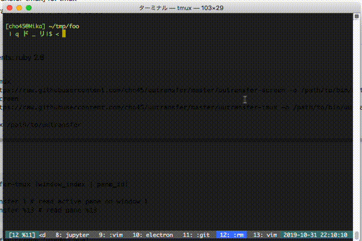

uutransfer
==========



uutransfer can transfer files using an existing screen / tmux session.

 * [./uutransfer-tmux] for tmux
 * [./uutransfer-screen] for GNU screen

## Install

Requirements: ruby 2.6

```
# for tmux
curl https://raw.githubusercontent.com/cho45/uutransfer/master/uutransfer-screen -o /path/to/bin/uutransfer
# for screen
curl https://raw.githubusercontent.com/cho45/uutransfer/master/uutransfer-tmux -o /path/to/bin/uutransfer

chmod +x /path/to/uutransfer
```

### Usage

```
uutransfer-tmux [window_index | pane_id]

$ uutransfer 1 # read active pane on window 1
$ uutransfer %13 # read pane %13
```

```
uutransfer-screen [window num]

$ uutransfer 1 # read window 1
```

## License
MIT (c) cho45@lowreal.net

